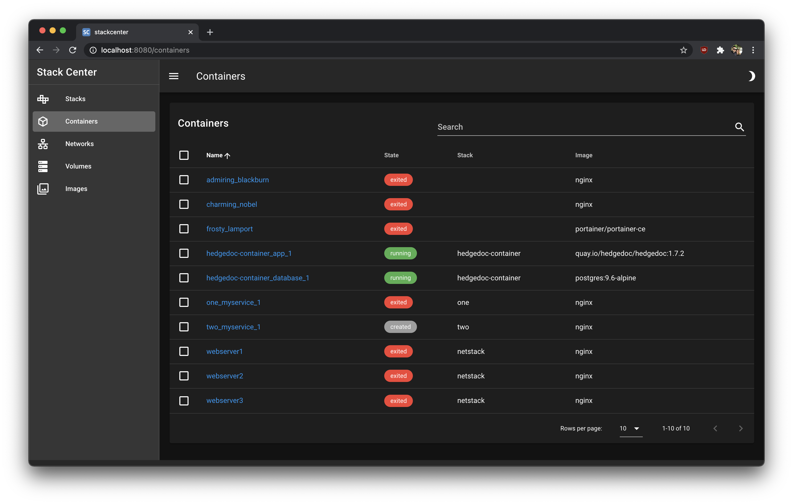
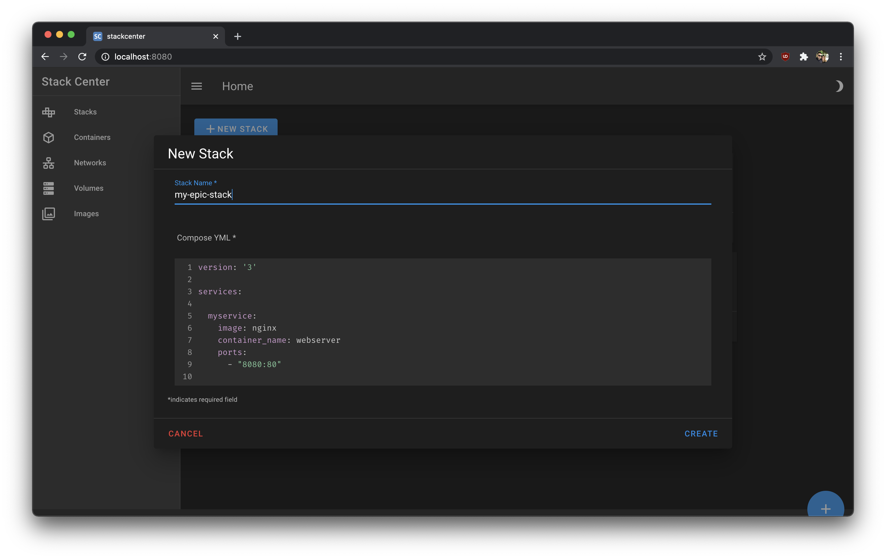

# StackCenter
A UI for managing docker containers and docker-compose stacks.

## Overview
The background for this project was a desire for a lighter-weight
[portainer](https://www.portainer.io/), without its various 
[shortcomings](https://github.com/portainer/portainer/issues/3750) or support
for things like Kubernetes.

## Features

 - Look at all your running containers!
 - Create docker-compose stacks through the web ui!
 - Inspect your docker-compose stacks!
 - Inspect/modify/delete networks, volumes and images!
 - Dark Mode 😎
 
## Screenshots





## Technology

The web client is built using Vue (2.x) and the backend is written in Python
with the Flask framework.

These both get smushed together into a Docker image by a Github workflow in this
repo, and published to the Github Container Registry (ghcr.io).

The app stores some local state (mostly stack metadata) in a sqlite database.

`docker-compose` will be bundled in the docker image, but for now it's just
broken.

## Running from Docker

Uh....ok. You are a bold one.

```
docker run -p 11111:5000 -v /var/run/docker.sock:/var/run/docker.sock ghcr.io/phybros/stackcenter:latest
```

StackCenter should now be running at http://localhost:11111.

# Development

So you want to work on StackCenter...

## Prerequisites

 - Docker & Docker Compose
 - Python 3.7+
 - Node 10
 - Yarn
 - A good attitude and positive outlook

## Running (for local dev)

 1. Clone the repo
 1. `cd frontend`
 2. `cp .env.local.sample .env.local` - this will make sure your local yarn 
 devserver hits the local flask app on port 5000
 3. `yarn serve` - at this point the app should come up on http://localhost:8080
 but **won't work properly until we run the backend**
 4. In a new terminal window...
 5. `cd backend`
 6. `python -m venv venv`
 7. `source venv/bin/activate`
 8. `pip install -r requirements.txt`
 9. `python -m app`

Now you have both the front and backend servers running locally and both with
hot reload!

## Contributing

Please fork the repo and send Pull Requests!
